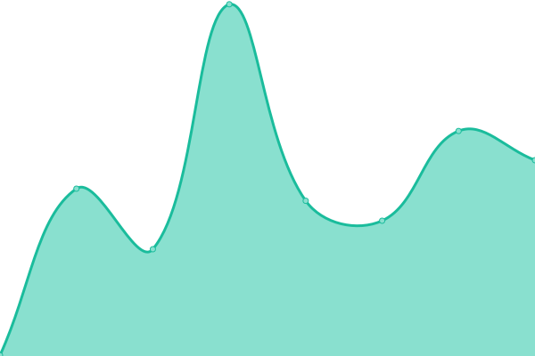
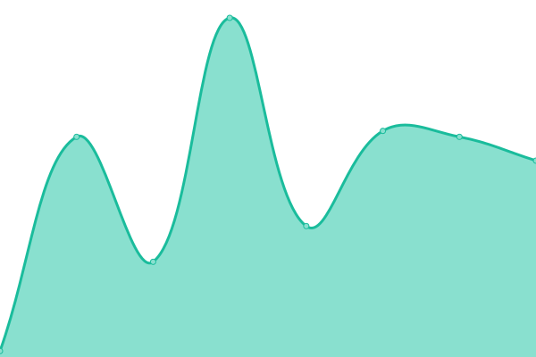
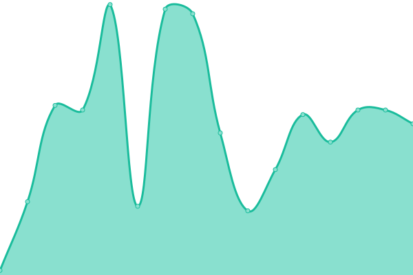
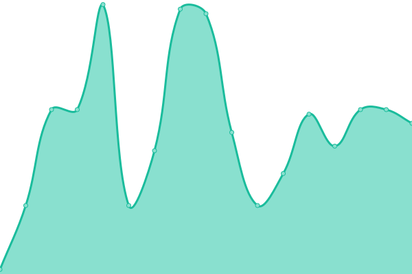

# [📈 Live Status](https://status2.yativo.com): <!--live status--> **🟧 Partial outage**

This repository contains the open-source uptime monitor and status page for [Bob-Manuel McLeod Sotonye](sotonye.com), powered by [Upptime](https://github.com/upptime/upptime).

With [Upptime](https://upptime.js.org), you can get your own unlimited and free uptime monitor and status page, powered entirely by a GitHub repository. We use [Issues](https://github.com/sotonye-m/upptime/issues) as incident reports, [Actions](https://github.com/sotonye-m/upptime/actions) as uptime monitors, and [Pages](https://status2.yativo.com) for the status page.

<!--start: status pages-->
<!-- This summary is generated by Upptime (https://github.com/upptime/upptime) -->
<!-- Do not edit this manually, your changes will be overwritten -->
<!-- prettier-ignore -->
| URL | Status | History | Response Time | Uptime |
| --- | ------ | ------- | ------------- | ------ |
|  [Yativo Fiat API](https://api.yativo.com) | 🟩 Up | [yativo-fiat-api.yml](https://github.com/sotonye-m/upptime/commits/HEAD/history/yativo-fiat-api.yml) | 

 6986ms
     
 | 

<a href="https://status2.yativo.com/history/yativo-fiat-api">99.05%</a>
    

|  [Yativo Crypto API](https://crypto-api.yativo.com/api/public/chains) | 🟥 Down | [yativo-crypto-api.yml](https://github.com/sotonye-m/upptime/commits/HEAD/history/yativo-crypto-api.yml) | 

 207ms
     
 | 

<a href="https://status2.yativo.com/history/yativo-crypto-api">97.74%</a>
    

|  [Yativo Fiat Dashboard](https://app.yativo.com) | 🟩 Up | [yativo-fiat-dashboard.yml](https://github.com/sotonye-m/upptime/commits/HEAD/history/yativo-fiat-dashboard.yml) | 

 152ms
     
 | 

<a href="https://status2.yativo.com/history/yativo-fiat-dashboard">100.00%</a>
    

|  [Yativo Crypto Dashboard](https://crypto.yativo.com) | 🟩 Up | [yativo-crypto-dashboard.yml](https://github.com/sotonye-m/upptime/commits/HEAD/history/yativo-crypto-dashboard.yml) | 

 150ms
     
 | 

<a href="https://status2.yativo.com/history/yativo-crypto-dashboard">100.00%</a>
    

|  [Crypto System Health](https://crypto-api.yativo.com/api/health/system) | 🟥 Down | [crypto-system-health.yml](https://github.com/sotonye-m/upptime/commits/HEAD/history/crypto-system-health.yml) | 

 80ms
     
 | 

<a href="https://status2.yativo.com/history/crypto-system-health">95.67%</a>
    

|  [Yativo KYC Platform](https://kyc.yativo.com) | 🟩 Up | [yativo-kyc-platform.yml](https://github.com/sotonye-m/upptime/commits/HEAD/history/yativo-kyc-platform.yml) | 

 805ms
     
 | 

<a href="https://status2.yativo.com/history/yativo-kyc-platform">99.61%</a>
    

|  [Yativo Docs](https://docs.yativo.com) | 🟩 Up | [yativo-docs.yml](https://github.com/sotonye-m/upptime/commits/HEAD/history/yativo-docs.yml) | 

 476ms
     
 | 

<a href="https://status2.yativo.com/history/yativo-docs">100.00%</a>
    

|  [Crypto Balance Service](https://crypto-api.yativo.com/api/health/balance-service) | 🟥 Down | [crypto-balance-service.yml](https://github.com/sotonye-m/upptime/commits/HEAD/history/crypto-balance-service.yml) | 

 40ms
     
 | 

<a href="https://status2.yativo.com/history/crypto-balance-service">97.75%</a>
    

|  [Crypto XDC WebSocket](https://crypto-api.yativo.com/api/health/xdc-websocket) | 🟥 Down | [crypto-xdc-web-socket.yml](https://github.com/sotonye-m/upptime/commits/HEAD/history/crypto-xdc-web-socket.yml) | 

 39ms
     
 | 

<a href="https://status2.yativo.com/history/crypto-xdc-web-socket">97.82%</a>
    

|  [Yativo Fiat Health](https://api.yativo.com/up) | 🟩 Up | [yativo-fiat-health.yml](https://github.com/sotonye-m/upptime/commits/HEAD/history/yativo-fiat-health.yml) | 

 741ms
     
 | 

<a href="https://status2.yativo.com/history/yativo-fiat-health">99.62%</a>
    

<!--end: status pages-->

[**Visit our status website →**](https://status2.yativo.com)

## 📄 License

- Powered by: [Upptime](https://github.com/upptime/upptime)
- Code: [MIT](./LICENSE) © [Anand Chowdhary](https://anandchowdhary.com), supported by [Pabio](https://pabio.com)
- Data in the `./history` directory: [Open Database License](https://opendatacommons.org/licenses/odbl/1-0/)
